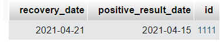

# Authors:
Michal Meshi Zahav - id = 324102037

# Email:
mmzmmz037@gmail.com

# APi requests:
1.**post** into personal_details table - /personalDetailsAdd
2.**get** from personal_details table - /personalDetailsAdd
3.**post** into vaccine_details table - /vaccineDetailsAdd
4.**get** from vaccine_details table - /vaccineDetailsGet
5.**post** into corona_patient table - /coronaPatientAdd
6.**get** from corona_patient table - /coronaPatientGet
7.**get** all data of patient - /data/:id
8.**get** the num of active patients in the last month - /activePatient - **bonus**
9.**get** the num of unvaccinated members - /membersNotVaccinated - **bonus**

# How to run:
1. Clone the repository
2. Run the command: `npm install`
3. Run the command: `npm bin/www`
4. create a database in phpmyadmin with the name: `db_corona`

# Screenshots of the tables:

# Screenshot of the get request:

